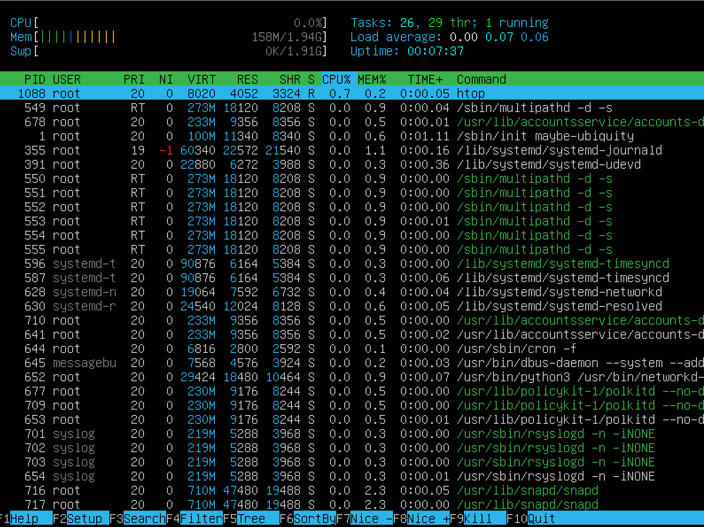
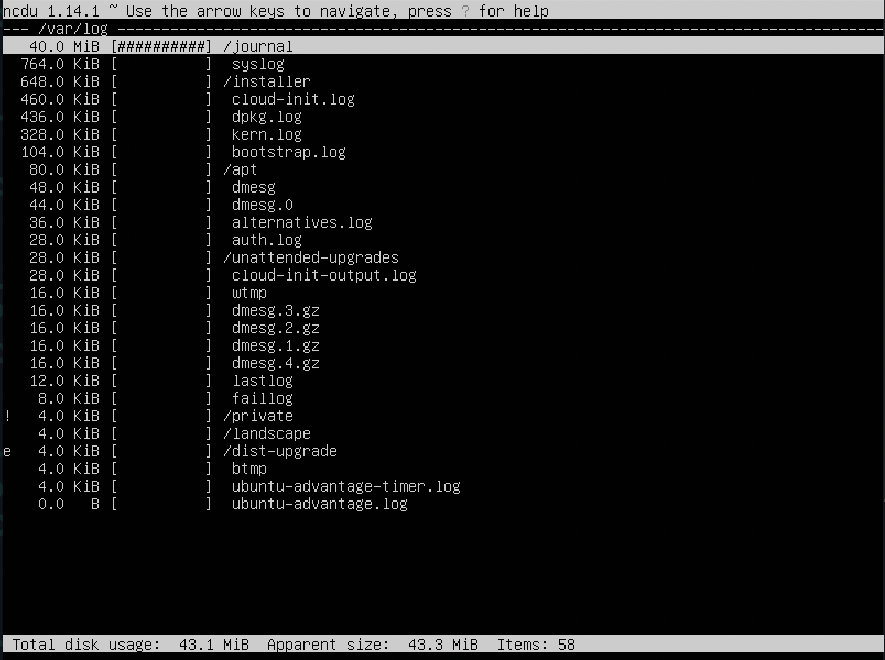
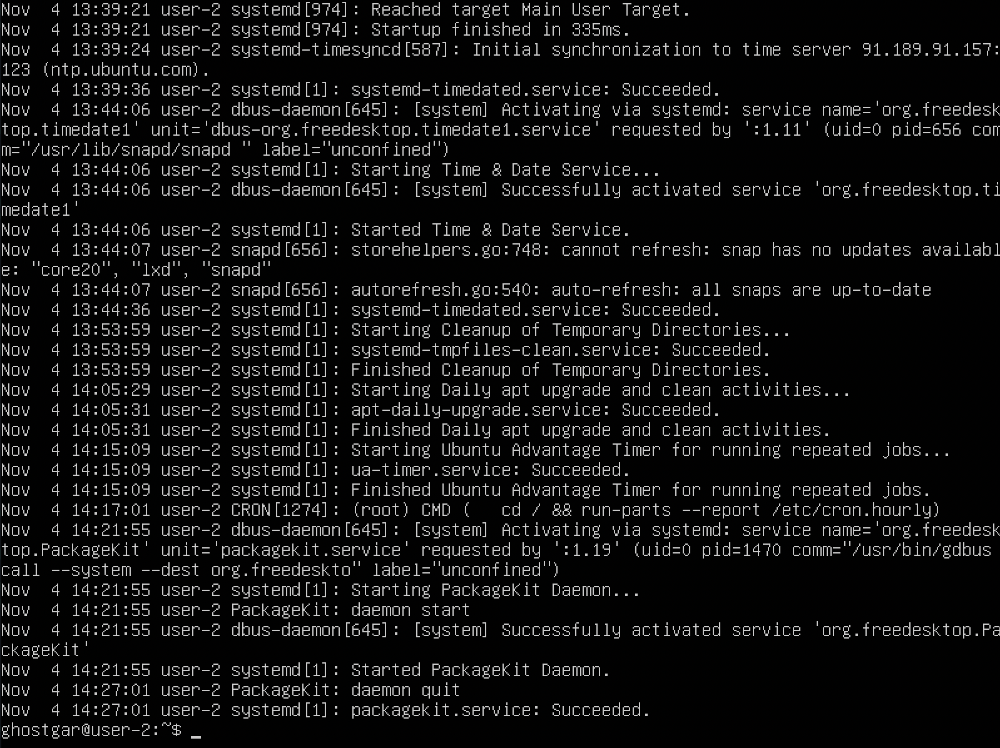

## Part 1. Установка ОС
* Узнаем версию Ubuntu, выполнив команду `cat /etc/issue`

## Part 2. Создание пользователя
* Командой - `sudo useradd uesr1` создаю пользователя.

* Командой - `sudo usermod -a -G adm uesr1` добавляю пользователя в группу adm, где **uesr1** – это имя пользователя, **-G** - добавляет пользователя в группу пользователей **adm**.

* Выводим нового пользователя uesr1 с помощью команды `cat /etc/passwd`

## Part 3. Настройка сети ОС
1. Задать название машины вида **user-1**
* Командой - `sudo hostnamectl set-hostname user-1` задал название машины **user-1**.

2. Установить временную зону,  соответствующую вашему текущему местоположению.

* Командой - `sudo timedatectl set-timezone Europe/Moscow` установил временную зону.
3. Вывести названия сетевых интерфейсов с помощью консольной команды.

> Скриншот с выводом команды `ip link show`
* Интерфейс lo - интерфейс обратной петли и позволяет компьютеру обращатся к самому себе. Интерфейс имеет ip-адрес 127.0.0.1 и необходим для нормальной работы системы.

4. Используя консольную команду получить ip адрес устройства, на котором вы работаете, от DHCP сервера.

- Вывожу название сетевых интерфейсов с помощью утилиты - `ip`.
DHCP (англ. Dynamic Host Configuration Protocol — протокол динамической настройки узла) — прикладной протокол, позволяющий сетевым устройствам автоматически получать IP-адрес и другие параметры, необходимые для работы в сети TCP/IP.

5. Определить и вывести на экран внешний ip-адрес шлюза (ip) и внутренний IP-адрес шлюза, он же ip-адрес по умолчанию (gw).

- С помощью команды - `wget`, определил внешний ip-адрес шлюза. Это можно сделать только создав запрос у сервера - какой ip-адрес клиента виден в запросе, прилетевшим от вас, так как рабочие станции из соображений безопасности не подключены напрямую к сети интернет.
- Командой `ip route | grep default` вывел внутренний ip-адрес шлюза, он же ip-адрес по умолчанию (gw).

6. Задать статичные (заданные вручную, а не полученные от DHCP сервера) настройки ip, gw, dns (использовать публичный DNS серверы, например 1.1.1.1 или 8.8.8.8).
* Вручную задал настройки ip, gw, dns с помощью sudo vi /etc/netplan/

7. Перезагрузить виртуальную машину. Убедиться, что статичные сетевые настройки (ip, gw, dns) соответствуют заданным в предыдущем пункте.
- Далее командой - `sudo netplan apply`, принимаю новые настройки.

- Командой `ping -c 5 ya.ru | ping -c 5 1.1.1.1` успешно пропинговал удаленные хосты 1.1.1.1 и ya.ru. 

## Part 4. Обновление ОС
- Командой `sudo apt-get upgrade` обновил системные пакеты до последней на момент выполнения задания версии.

- Сообщение, что системе больше не требуются обновления действительно получено.

## Part 5. Использование команды **sudo**

> Внес пользователя в группу sudo, чтобы он мог пользоваться sudo.
* sudo (англ. Substitute User and do, дословно «подменить пользователя и выполнить») — программа для системного администрирования UNIX-систем, позволяющая делегировать те или иные привилегированные ресурсы пользователям с ведением протокола работы. Основная идея — дать пользователям как можно меньше прав, при этом достаточных для решения поставленных задач. Программа поставляется для большинства UNIX и UNIX-подобных операционных систем.

* Команда sudo предоставляет возможность пользователям выполнять команды от имени суперпользователя root, либо других пользователей.
## Part 6. Установка и настройка службы времени
* Настроить службу автоматической синхронизации времени.

- Командой `timedatectl show` вывожу время, часового пояс, в котором я сейчас нахожусь.
## Part 7. Установка и использование текстовых редакторов 
1. Используя каждый из трех выбранных редакторов, создайте файл test_X.txt, где X -- название редактора, в котором создан файл. Напишите в нём свой никнейм, закройте файл с сохранением изменений.

- Vim. Для выхода с сохранением изменений - `:wq`.

- Nano. Можно выйти из редактора сочетанием клавиш - **ctrl+X** и он сам предложит сохранить изменения в файле перед выходом.

- MCEDIT. Для выхода с сохранением изменений использовал нажатие клавиш **f2** и **f10**. Так же можно выйти из редактора нажатием клавиши **f10** и он сам предложит сохранить изменения в файле перед выходом.

2. Используя каждый из трех выбранных редакторов, откройте файл на редактирование, отредактируйте файл, заменив никнейм на строку "21 School 21", закройте файл без сохранения изменений.

- Vim. Для выхода без сохранения изменений командой - `:q!`.

- Nano. Для выхода без сохранения изменений использовал сочетание клавиш - **ctrl+X** и отказался от сохранения изменений.

- MCEDIT. Для выхода без сохранения изменений использовал клавишу - **f2** и отказался от сохранения изменений.

3. Используя каждый из трех выбранных редакторов, отредактируйте файл ещё раз (по аналогии с предыдущим пунктом), а затем освойте функции поиска по содержимому файла (слово) и замены слова на любое другое.

- Vim. Для поиска слова в файле ввожу в управляющую строку знак `/`.

- Vim. Для замены слова на другое использую команду `:s/{искомое слово}/{на что заменить}`

- Nano. Для поиска слова в файле использовал сочетание клавиш - **ctrl+W**.

- Nano. Для замены слова на другое использовал сочетание клавиш - **ctrl+\\**.

- MCEDIT. Нажимаю fn+f7, ввожу слово поиска.

- MCEDIT. Нажимаю fn+f4, ввожу слово, которое необходимо заменить, и слово, на которое нужно заменить.

## Part 8. Установка и базовая настройка сервиса **SSHD**
1. Установить службу SSHd.
- Для установки службы SSHd выполняю команды `sudo apt update` - `sudo apt install openssh-server`.
2. Добавить автостарт службы при загрузке системы.
- Командой - `sudo systemctl enable ssh`, добавляю ssh в автозагрузку.
3. Перенастроить службу SSHd на порт 2022.
- Для смены порта подключения со стандартного на пользовательский нужно отредактировать конфигурационный файл - `/etc/ssh/sshd_config`. Раскомментировать строку **Port 22** и изменить значение на **2022**.

4. Используя команду ps, показать наличие процесса sshd. Для этого к команде нужно подобрать ключи.

* Для вывода процессов **sshd** использовал команду - `ps -C sshd -F`. Команда **ps** используется для листинга процессов в Linux системах, ключ **-С** дает возможность вывода по команде, которая запустила процесс, **-F** показывает полную информацию по процессу: _UID_ - идентификатор пользователя выполняющего команду, _PID_ - это идентификатор процесса команды, _PPID_ - идентификатор родительского процесса, который отпустил команду, _C_ - количество дочерних процессов, _STIME_ - это время начала процесса, TTY - тип терминала, TIME - это общее время использования процессорного времени процессом (00:00:00 напротив процесса bash указывает, что процессорное время вообще не было использовано до сих пор), CMD - это имя команды, которая запустила этот процесс. Дополнительные столбцы - _SZ, RSS_ и _PSR. SZ_ - это размер процесса, _RSS_ - реальный размер памяти, а _PSR_ - процессор, которому назначена команда.
5. Перезагрузить систему.
- Перезагружаю систему командой - `sudo shutdown -r now`.

>Использование команды netstat
* Команда **netstat** - инструмент для мониторинга сетей TCP / IP, который может отображать таблицы маршрутизации, фактические сетевые подключения и информацию о состоянии каждого устройства сетевого интерфейса. Ключ **-t** отбражает порты протокола _TCP_, **-a** выводит все соединения, **-n** использует при выводе IP-адрес напрямую, а не через сервер доменных имен.
Значения столбцов:
- **Proto**: протокол, используемый сокетом.
- **Recv-Q**: количество байтов, не скопированных пользовательской программой, подключенной к этому сокету.
- **Send-Q**: количество неподтвержденных байтов удаленного хоста.
- **Local Address**: локальный адрес (имя локального хоста) и номер порта сокета. Если не указана опция -n, адрес сокета разрешается в соответствии с полным именем хоста (FQDN), а номер порта преобразуется в соответствующее имя службы.
- **State**: состояние сокета. 
- **Foreign Address**: удаленный адрес (имя удаленного хоста) и номер порта сокета.
- **0.0.0.0** означает, что никто не подключен, все соединения **LISTENING** имеют внешний адрес **0.0.0.0**.

## Part 9. Установка и использование утилит **top**, **htop**
1. Установить и запустить утилиты top.

- uptime - 3 min
- количество авторизованных пользователей  - 1
- общую загрузку системы 0.04, 0.16, 0.08
- общее количество процессов 100
- загрузку cpu - 0.0 us, 0.0 sy, 0.0 ni, 100.0 id, 0.0 wa, 0.0 hi, 0.0 si, 0.0 st.
Это проценты времени процессора, затраченного на выполнение процессов: us — пользовательские процессы (высокое значение данного показателя может указывать, в том числе, на проблемы в коде сайта, необходимость его оптимизации), sy — процессы ядра, id — неиспользуемые ресурсы (чем выше этот показатель, тем лучше), wa — операции ввода/вывода, т.е. дисковые операции
- загрузку памяти 156.5 mb
- pid процесса занимающего больше всего памяти 1
- pid процесса, занимающего больше всего процессорного времени 1
2. Установить и запустить утилиты htop.
`sudo apt install htop`
`sudo htop`

Далее рассмотрим все виды сортировок:

>Скриншот с сортировкой по _PID_.

>Скриншот с сортировкой по _PERCENT_CPU_.

>Скриншот с сортировкой по _PERCENT_MEM_.

>Скриншот с сортировкой по _TIME_.

- Для фильтра `fn + F4` и ввожу sshd

- Для поиска `fn + F3` и ввожу syslog:

- Для настройки вывода hostname, clock и uptime `fn + F2` добавляю нужные виджеты и использую `fn + F10` для выхода:

## Part 10. Использование утилиты **fdisk**

>Скриншот с выводом команды sudo  fdisk -l.
- название жесткого диска: _/dev/sda, VBOX HARDDISK
- размер: _12.86 GiB, 13784580096 bytes_.
- количество секторов: 26923008 sectors.
- размер swap: 2003964.

- Командой `cat /proc/swaps` вывожу размер swap.
## Part 11. Использование утилиты **df** 
1. Запустить команду df.

- размер раздела: _10218772_.
- размер занятого пространства: _4610512_.
- размер свободного пространства: _5067588_.
- процент использования: _48%_.
- единицу измерения в выводе: _килобайты_.

2. Запустить команду df -Th.

- размер раздела: 9.6G.
- размер занятого пространства: _4.4G_.
- размер свободного пространства: _4.9G_.
- процент использования: _48%_.
- тип файловой системы: _ext4_.

## Part 12. Использование утилиты **du**
1. Вывожу размер папок /home, /var, /var/log (в байтах, в человекочитаемом виде)

>Скриншот с выводом команд - `sudo du /home -s --block-size=1`, а также `sudo du /var -s --block-size=1` и включая `sudo du /var/log -s --block-size=1`.

2. Вывожу размер всего содержимого в /var/log (не общее, а каждого вложенного элемента, используя *)

>Скриншот с выводом команды - `sudo du /var/log/* -ah --block-size=1`

## Part 13. Установка и использование утилиты **ncdu**

>Скриншот с выводом команды - `sudo apt install ncdu`

>Скриншот с выводом команды - `ncdu /`

>Скриншот с выводом команды - `ncdu /var`

>Скриншот с выводом команды - `ncdu /var/log`

## Part 14. Работа с системными журналами

> Скриншот с выводом содержимого `dmesg`

- dmesg - Драйвера устройств

> Скриншот с выводом содержимого `syslog`

> Скриншот с выводом содержимого `auth.log`
- время последней успешной авторизации `15:07:40`
- имя пользователя `ghostgar`
- метод входа в систему `LOGIN`

> Скриншот с выводом содержимого `auth.log` после рестарта sshd

## Part 15. Использование планировщика заданий **CRON**
- открываю файл пларовщика задач cron с помощью команды `crontab -e` и вношу изменения:

> Скриншот с отредактированным файлом crontab

> Скриншот с логами работы cron

- открываю файл пларовщика задач cron с помощью команды `crontab -e`, удаляю задачу

> Скриншот с отредактированным файлом crontab